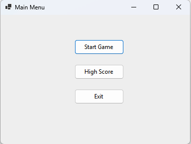

## Tutorial: Cara Berpindah Antar Form di Windows Forms Tanpa Menggunakan Designer

### Tujuan
Mempelajari cara berpindah dari satu form ke form lain dalam aplikasi Windows Forms tanpa menggunakan designer. Setiap form dan kontrolnya akan diatur sepenuhnya melalui kode, memungkinkan pengguna untuk berpindah antar form dengan menggunakan tombol di form utama.



### Lingkungan Pengembangan
1. Platform: .NET 6.0
2. Bahasa: C# 10
3. IDE: Visual Studio 2022

---

## Langkah-langkah

### 1. Membuat Form Utama (MainForm)

1. Buat kelas `MainForm` yang meng-extend `Form`.
2. Tambahkan properti dan pengaturan dasar untuk form utama.
3. Buat kelas `Program` dan instansiasi `MainForm` di metode `Main` untuk menjalankan aplikasi.

4. **Kode untuk `MainForm.cs`:**

   ```csharp
   using System;
   using System.Drawing;
   using System.Windows.Forms;

   namespace FormNavigation
   {
       public class MainForm : Form
       {
           public MainForm()
           {
               InitializeForm();
           }

           private void InitializeForm()
           {
               this.Text = "Main Menu";
               this.Size = new Size(400, 300);
               this.StartPosition = FormStartPosition.CenterScreen;
           }
       }
   }
   ```

5. **Kode untuk `Program.cs`:**

   ```csharp
   using System;
   using System.Windows.Forms;

   namespace FormNavigation
   {
       internal static class Program
       {
           [STAThread]
           static void Main()
           {
               Application.EnableVisualStyles();
               Application.SetCompatibleTextRenderingDefault(false);
               Application.Run(new MainForm());
           }
       }
   }
   ```

6. **Penjelasan**:
   - `InitializeForm()`: Mengatur properti dasar untuk form utama seperti ukuran, judul, dan posisi.
   - `Application.Run(new MainForm());`: Menjalankan aplikasi dengan `MainForm` sebagai form utama.

7. **Menjalankan Aplikasi**:
   - Setelah menambahkan kode, jalankan aplikasi. Form utama (`MainForm`) akan muncul dengan pengaturan dasar.

---

### 2. Membuat Form Game

1. Buat kelas `GameForm` yang meng-extend `Form`.
2. Tambahkan properti dan pengaturan dasar untuk form game.
3. Tambahkan tombol **Back** di `GameForm` untuk memungkinkan pengguna kembali ke **MainForm**.
4. Tambahkan tombol **Start Game** di `MainForm` untuk membuka `GameForm`.

5. **Kode untuk `GameForm.cs`:**

   ```csharp
   using System;
   using System.Drawing;
   using System.Windows.Forms;

   namespace FormNavigation
   {
       public class GameForm : Form
       {
           private Button backButton;

           public GameForm()
           {
               InitializeForm();
               InitializeControls();
           }

           private void InitializeForm()
           {
               this.Text = "Game Level";
               this.Size = new Size(800, 600);
               this.StartPosition = FormStartPosition.CenterScreen;
           }

           private void InitializeControls()
           {
               // Tombol Back
               backButton = new Button
               {
                   Text = "Back",
                   Location = new Point(10, 10),
                   Size = new Size(80, 30)
               };
               backButton.Click += BackButton_Click;
               this.Controls.Add(backButton);
           }

           private void BackButton_Click(object sender, EventArgs e)
           {
               // Menutup GameForm dan kembali ke MainForm
               this.Close();
           }
       }
   }
   ```

6. **Memperbarui `MainForm` untuk Menambahkan Tombol Start Game**:

   ```csharp
   public class MainForm : Form
   {
       private Button startGameButton;

       public MainForm()
       {
           InitializeForm();
           InitializeControls();
       }

       private void InitializeForm()
       {
           this.Text = "Main Menu";
           this.Size = new Size(400, 300);
           this.StartPosition = FormStartPosition.CenterScreen;
       }

       private void InitializeControls()
       {
           // Tombol Start Game
           startGameButton = new Button
           {
               Text = "Start Game",
               Location = new Point(150, 50),
               Size = new Size(100, 30)
           };
           startGameButton.Click += StartGameButton_Click;
           this.Controls.Add(startGameButton);
       }

       private void StartGameButton_Click(object sender, EventArgs e)
       {
           GameForm gameForm = new GameForm();
           gameForm.FormClosed += (s, args) => this.Show(); // Menampilkan kembali MainForm saat GameForm ditutup
           gameForm.Show();
           this.Hide();
       }
   }
   ```

7. **Penjelasan**:
   - `InitializeControls()`: Menambahkan tombol **Start Game** di `MainForm` untuk membuka `GameForm`.
   - `StartGameButton_Click`: Membuka `GameForm` dan menyembunyikan `MainForm`. Ketika `GameForm` ditutup (misalnya, dengan menekan tombol **Back**), `MainForm` akan ditampilkan kembali.

8. **Menjalankan Aplikasi**:
   - Jalankan aplikasi dan klik tombol **Start Game** di `MainForm`. `GameForm` akan terbuka, dan `MainForm` akan disembunyikan. Klik tombol **Back** di `GameForm` untuk kembali ke `MainForm`.

---

### 3. Membuat Form High Score

1. Buat kelas `HighScoreForm` yang meng-extend `Form`.
2. Tambahkan properti dan pengaturan dasar untuk form high score.
3. Tambahkan tombol **High Score** di `MainForm` untuk membuka `HighScoreForm`.

4. **Kode untuk `HighScoreForm.cs`:**

   ```csharp
   using System.Drawing;
   using System.Windows.Forms;

   namespace FormNavigation
   {
       public class HighScoreForm : Form
       {
           public HighScoreForm()
           {
               InitializeForm();
           }

           private void InitializeForm()
           {
               this.Text = "High Scores";
               this.Size = new Size(400, 300);
               this.StartPosition = FormStartPosition.CenterScreen;

               Label label = new Label
               {
                   Text = "High Scores",
                   Font = new Font("Arial", 18, FontStyle.Bold),
                   AutoSize = true,
                   Location = new Point(150, 20)
               };
               this.Controls.Add(label);
           }
       }
   }
   ```

5. **Memperbarui `MainForm` untuk Menambahkan Tombol High Score**:

   ```csharp
   public class MainForm : Form
   {
       private Button startGameButton;
       private Button highScoreButton;

       public MainForm()
       {
           InitializeForm();
           InitializeControls();
       }

       private void InitializeControls()
       {
           // Tombol Start Game
           startGameButton = new Button
           {
               Text = "Start Game",
               Location = new Point(150, 50),
               Size = new Size(100, 30)
           };
           startGameButton.Click += StartGameButton_Click;
           this.Controls.Add(startGameButton);

           // Tombol High Score
           highScoreButton = new Button
           {
               Text = "High Score",
               Location = new Point(150, 100),
               Size = new Size(100, 30)
           };
           highScoreButton.Click += HighScoreButton_Click;
           this.Controls.Add(highScoreButton);
       }

       private void HighScoreButton_Click(object sender, EventArgs e)
       {
           HighScoreForm highScoreForm = new HighScoreForm();
           highScoreForm.ShowDialog();
       }
   }
   ```

6. **Penjelasan**:
   - `HighScoreButton_Click`: Membuka `HighScoreForm` sebagai modal dialog menggunakan `ShowDialog()`.

7. **Menjalankan Aplikasi**:
   - Jalankan aplikasi dan klik tombol **High Score** di `MainForm`. `HighScoreForm` akan terbuka sebagai dialog, dan `MainForm` akan menunggu hingga dialog ditutup.

---

### 4. Menambahkan Tombol Exit Game

1. Kembali ke `MainForm` dan tambahkan tombol **Exit** untuk menutup aplikasi.

2. **Memperbarui `MainForm` untuk Menambahkan Tombol Exit**:

   ```csharp
   public class MainForm : Form
   {
       private Button startGameButton;
       private Button highScoreButton;
       private Button exitButton;

       public MainForm()
       {
           InitializeForm();
           InitializeControls();
       }

       private void InitializeControls()
       {
           // Tombol Start Game
           startGameButton = new Button
           {
               Text = "Start Game",
               Location = new Point(150, 50),
               Size = new Size(100, 30)
           };
           startGameButton.Click += StartGameButton_Click;
           this.Controls.Add(startGameButton);

           // Tombol High Score
           highScoreButton = new Button
           {
               Text = "High Score",
               Location = new Point(150, 100),
               Size = new Size(100, 30)
           };
           highScoreButton.Click += HighScoreButton_Click;
           this.Controls.Add(highScoreButton);

           // Tombol Exit
           exitButton = new Button
           {
               Text = "Exit",
               Location = new Point(150, 150),
               Size = new Size(100, 30)
           };
           exitButton.Click += ExitButton_Click;
           this.Controls.Add(exitButton);
       }

       private void ExitButton_Click(object sender, EventArgs e)
       {
           Application.Exit();
       }
   }
   ```

3. **Penjelasan**:
   - `ExitButton_Click`: Menutup aplikasi dengan memanggil `Application.Exit()`.

4. **Menjalankan Aplikasi**:
   - Jalankan aplikasi dan klik tombol **Exit** di `MainForm`. Aplikasi akan menutup sepenuhnya.
